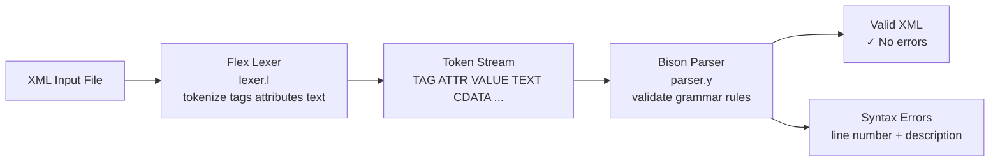

# XML Syntax Analyzer

A syntax analyzer that validates XML documents and reports syntax errors. Built with Flex (lexical analysis) and Bison (grammar/parser), it implements a formal BNF grammar for XML and provides meaningful error messages for malformed input.

## Tech Stack

- **Language:** C
- **Lexer:** Flex (`src/lexer.l`)
- **Parser:** Bison (`parser.y`)
- **Grammar:** BNF specification (`BNF.bnf`)
- **Build:** GNU Make

## Architecture Overview



## Project Structure

```
xml-parser/
├── BNF.bnf                 # Formal BNF grammar for XML
├── src/
│   ├── lexer.l             # Flex lexer rules (tokenize XML)
│   ├── parser.y            # Bison grammar + semantic actions
│   ├── helper.h            # Shared type definitions and helpers
│   └── Makefile            # Build rules
└── examples/
    ├── example1.xml        # Test case 1
    └── example2.xml        # Test case 2
```

## How to Build and Run

### Build

```bash
cd src
make
```

This runs `flex` on `lexer.l`, `bison` on `parser.y`, and compiles the resulting C files into the `xml_analyzer` binary.

### Run

```bash
./xml_analyzer < ../examples/example1.xml
./xml_analyzer < ../examples/example2.xml
```

### Manual build steps

```bash
flex lexer.l          # generates lex.yy.c
bison -d parser.y                # generates parser.tab.c + parser.tab.h
gcc -o xml_analyzer lex.yy.c parser.tab.c -lfl -lm
```

## XML Grammar (Summary)

The BNF grammar covers:
- Document structure: `<?xml ... ?>` prolog + root element
- Elements: opening/closing tags with optional attributes
- Attributes: `name="value"` pairs
- Text content and CDATA sections
- Nested elements (recursive grammar rules)
- Self-closing tags (`<tag />`)

## Notes

- The analyzer reports the line number and a description of each syntax error encountered.
- Two sample XML files are included for testing both valid and invalid documents.
- The grammar is implemented as a context-free grammar in Bison; XML namespace support is not included.

